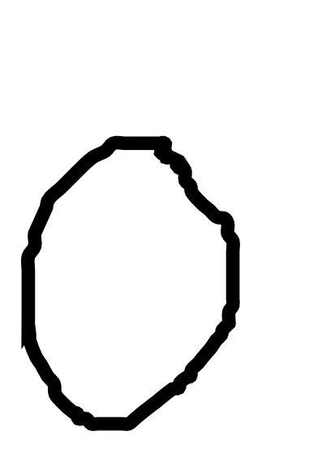
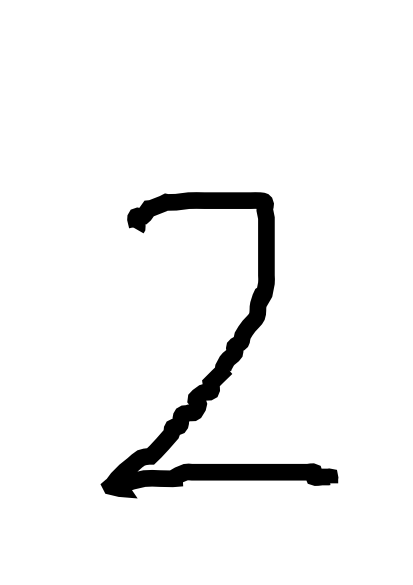
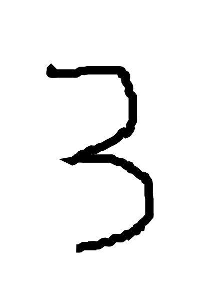
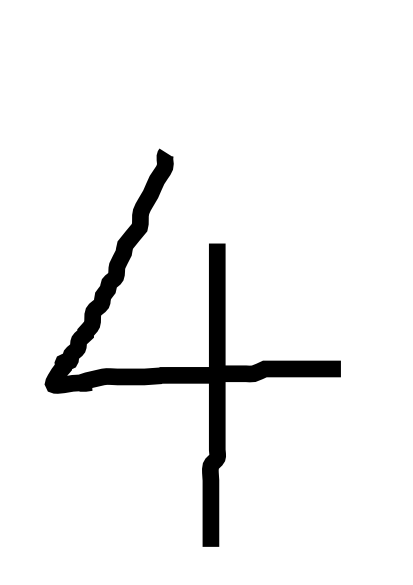
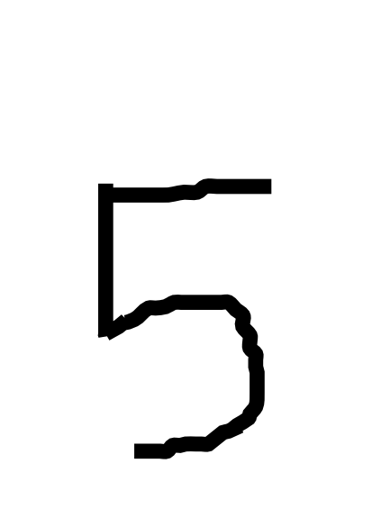
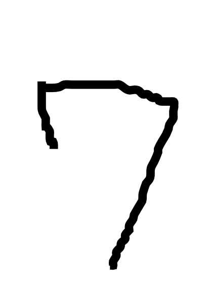
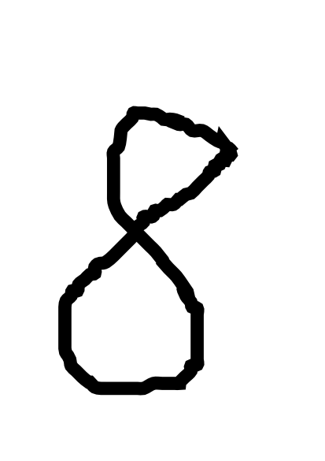
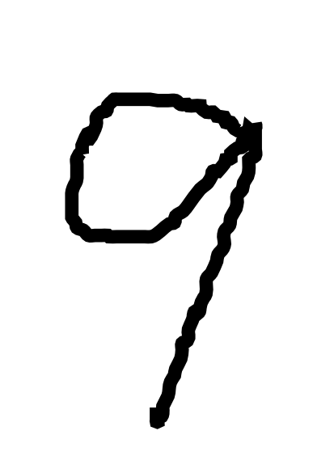

# handwrite-digit-data
- MNISTで学習したモデルをテストする自作の手書き文字です。
  - 0〜9の文字が1画像ずつ、合計10ファイル入っています。
  - 手書きと言いながらInkscapeでフリーハンドで書いているため、手鉤文字ではないと言えます。
- NVIDIA が公開した[DIGITS](https://github.com/NVIDIA/DIGITS)で使うことを念頭に置いているため、
アスペクト比は正方形ではなく、解像度も高めのpng形式のファイルです。
- Qiitaで公開した記事 [GPUなしでDIGITSで始めるDeepLearning](http://qiita.com/kumadasu/items/bf26cd2824eaef8f2bf8)で参照しています。

# 画像（縮小して表示）

